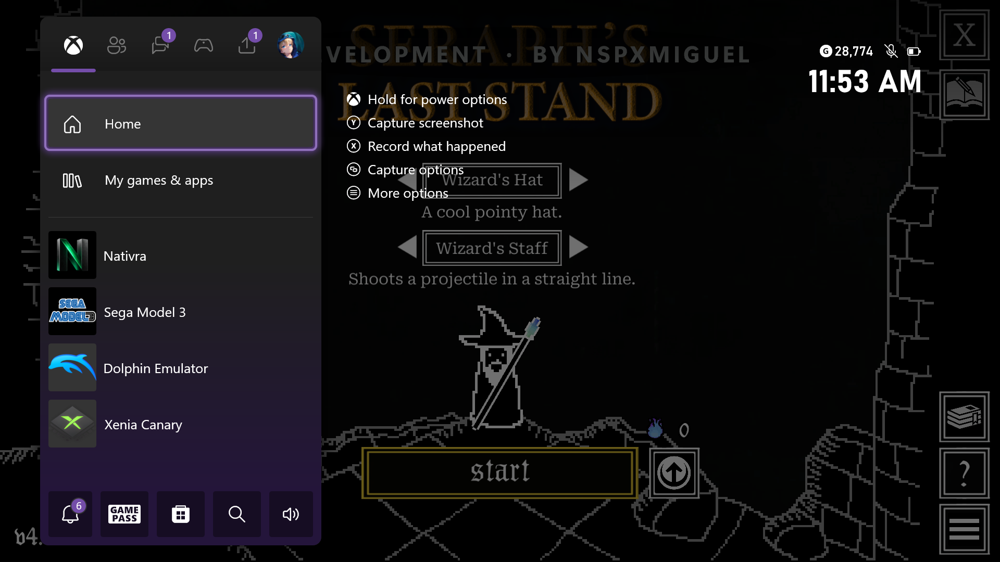
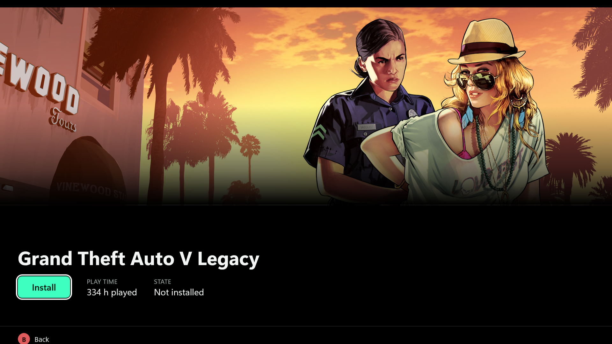
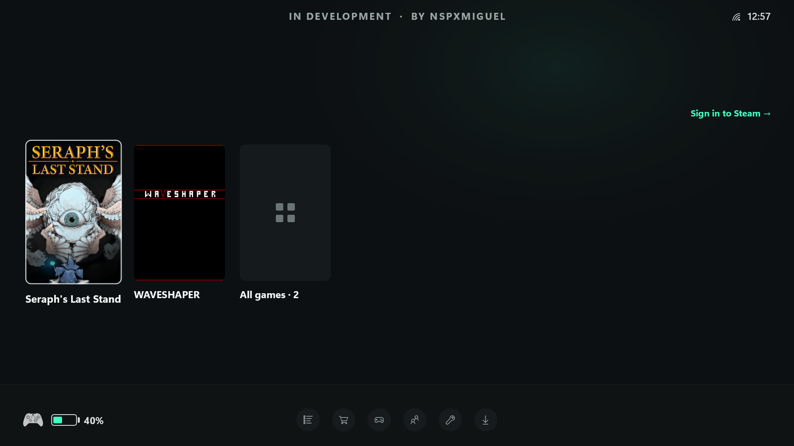
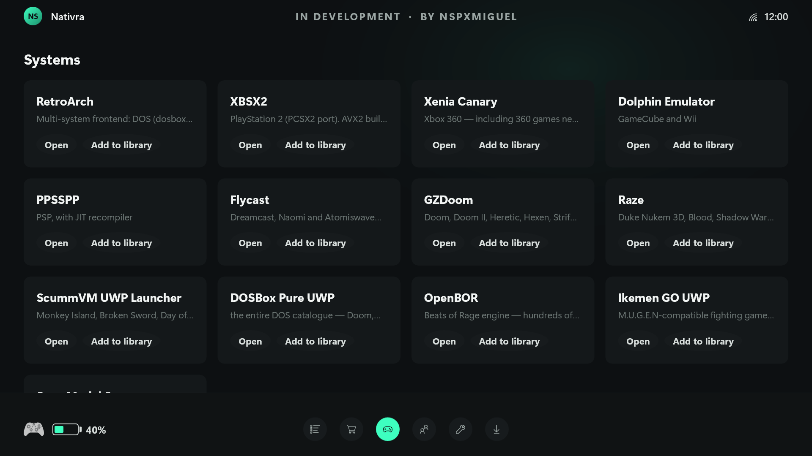

# Nativra

**One Xbox game hub. Native PC games, emulation, and less setup.**

**[Português (Brasil)](README.pt-BR.md) · English**

> [!WARNING]
> **NOT READY FOR USE. CURRENTLY IN TESTING AND DEVELOPMENT.**
>
> Nativra is built by **one person**, who also has other commitments.
> This is a hobby project, shared for free, with no team behind it.
> I am investing my own money in several AI tools, my time, and a substantial
> amount of effort to bring this idea to life — figuring things out, making
> mistakes, testing, and trying again.
>
> Seeing a game open for the first time is a milestone, **not a sign that the
> app is ready**. There is no promised deadline, compatibility guarantee, or
> immediate support. Please be patient and respectful of this work.
>
> — **NSPXMIGUEL**

An experimental all-in-one gaming hub for Xbox Series X|S in official Developer
Mode. Native PC-game execution is its main technical focus, not its whole purpose.

**Experimental pre-alpha · proof of concept — not ready for everyday play.**

> [!IMPORTANT]
> **Current priority: running PC games on the Xbox itself.** Development is
> focused on getting a game to launch from the app and remain playable, stable
> and responsive. Other parts of Nativra are unfinished, partially connected or
> not working yet while this core functionality takes priority. Their presence
> in the interface or roadmap does not mean they are ready to use.

[First milestone](docs/progress/2026-09-23.md) ·
[Releases](https://github.com/NspxMiguel/nativra/releases) ·
[Contributing](docs/CONTRIBUTING.md) · [License](LICENSE)

## PC games running on Xbox

### On the Xbox itself

Real console capture, build 179: Xbox Guide open over the game, showing Nativra.

### The game in full screen

Real console capture, build 174. Menu rendering is confirmed; stable gameplay
and online features are not. The screenshot is not generated artwork.

Not streaming. Not a remote desktop. The game is downloaded by the console
itself, from the player's own Steam account, and executed on the console's own
processor — which is an x86-64 running Windows NT, and has been all along.

## Steam integration

QR sign-in, your owned and family-shared library, collections, search and game downloads — directly from Nativra. SteamAPI and social features remain unfinished.

### Steam game details

Real build 189 console capture: a Steam library detail page, **not GTA V running**.
The play time comes from Steam account history, not time played through Nativra.
GTA V is not installed in this capture and has not been validated as compatible.
This detail screen is an unfinished Nativra interface, not Steam's own game page.
It currently exposes only artwork, play time and installation state. The panoramic
artwork is now shown without the earlier side crop; layout still needs work,
including the partially clipped Back footer. Achievements, last-played information
and the full set of game-management actions are not implemented here yet.

## Inside the app

Real build 188 console capture: portrait covers and a white outline around the
selected game. A game appearing in the library does not establish compatibility;
WAVESHAPER is not playable through the current loader. This is pre-alpha UI,
not a design mockup. The Steam sign-in shortcut is still shown even with a saved
session; it is not a reliable account-status indicator.

### Emulator shelf

Real build 179 console capture: installed-system entries and library shortcuts.
Listing an emulator here does not establish game compatibility or complete setup.

## More than a PC-game loader

The goal is a controller-first gaming environment with the convenience of
SteamOS and the setup automation of EmuDeck: sit on the sofa, connect your drive,
find a game, and play from one app. These are design references, not affiliations
or claims that Nativra already matches either project.

- **Native PC games and stores.** Run the games on the Xbox itself, without
  streaming. Steam is the first integration; Epic and GOG are planned.
- **One library.** Bring PC games, emulator games and owned-but-not-installed
  titles together, with artwork, search, collections, favorites and hidden items.
- **An emulation setup assistant.** Install and configure emulators, controller
  mappings and storage paths; import the user's game files and identify the
  target system. The intended experience is “add your games and play,” not
  manually configuring each emulator. Hosting emulators inside the app is a goal,
  not a completed replacement for installed UWP emulator packages.
- **Files and downloads in one place.** Recognize and organize user-supplied
  files from storage. Planned magnet, `.torrent` and Telegram intake feeds the
  same workflow, asking which system a file belongs to when detection is unsure.
  No game sources, trackers, proprietary BIOS or keys are supplied.
- **Mods and saves.** A shared mod hub for PC and emulated games, with a planned
  connection to SwitchSaveSync for moving the owner's saves between devices.
- **A self-contained ecosystem.** Community app/emulator sources inspired by
  Cydia, installation and updates, first-run setup, storage choices, multiple
  accounts and model-specific compatibility reports are part of the roadmap.
  Steam achievements, friends, invitations and logout are requirements too.

## Scope versus current implementation

| Area | Current state |
| --- | --- |
| Native PC execution | Seraph's main menu displayed on Series X; stable gameplay remains unverified. |
| Steam | QR login, library and download code exist; SteamAPI and social/game integration remain unfinished. |
| Library and emulator shelf | In-app screens and shelf shortcuts exist; unified game-level import is incomplete. |
| Emulator setup | Package catalog, CLI installation/configuration tools and configuration files exist. Not every emulator is verified, and the whole flow is not available inside the app. |
| BIOS/file recognition | Local recognition/filing modules and owner-dump guidance exist; the controller-driven onboarding flow is unfinished. |
| Torrent and Telegram | Queue and detection plumbing exist; both transfer implementations are explicitly unimplemented. |
| Epic/GOG, mod hub, save sync, community sources, multi-account and compatibility site | Planned; not shipped as working end-to-end features. |

See [the full product brief](docs/DESIGN-BRIEF.md), [emulator setup](docs/EMULATORS.md),
[file intake](docs/INTAKE.md) and [user-supplied BIOS handling](docs/BIOS.md).
Those documents also contain design targets and historical investigations;
their presence is not a compatibility guarantee.

## Why this is possible at all

An Xbox is not a different computer from a PC. It is the same architecture
running the same kernel, with a different set of rules about what a program is
allowed to do. A developer-mode console will run a packaged app, and a packaged
app can map an ordinary Windows binary into itself: sections, relocations,
imports, exception tables, thread local storage. Of the 931 functions the first
game tried to import, 753 resolved to the console's own Windows.

The remaining 178 are the project. They are not translation — nothing is being
emulated — they are the handful of libraries a packaged app does not have
loaded, answered by hand. The window system is the big one, because a console
has no windows.

## What works today

- **Sign in to Steam** on the console, by QR code, natively.
- **The full library**: owned games and family-shared ones, with the account's
  real collections, filters and search.
- **Downloading on the console**, from Steam's own content servers: the client
  protocol, depot keys, manifests, chunks, and all three container formats.
- **A game detail screen** with artwork, playtime, and an install dialog that
  asks where to put it.
- **Loading a game's binaries** — the engine of a commercial Unity game maps,
  relocates, resolves and runs inside the app.
- **Remote control of the console** from a terminal, for testing.

## What does not work yet

**Experimental, not a finished PC-game compatibility layer.** Seraph's Last
Stand's actual main menu has rendered on Xbox Series X. This is not yet proof
of a stable, playable match. See the [console milestone and original
screenshot](docs/progress/2026-09-23.md).

The measured presentation path was capped at 20 updates per second, independently
of the game's render loop. Removing that cap and launching a selected Steam
game from the app are implemented but awaiting console validation. Native window
message dispatch still needs stability testing. Sound is not working in the
measured run (FMOD falls back to silent output); SteamAPI initialization fails.
Multiplayer, achievements, friend invitations and LEGO Jurassic World are not
validated. No license or authentication checks are bypassed.

See [docs/ISSUES.md](docs/ISSUES.md) — the rest of the work is partitioned, and
a lot of it needs no console.

## Using it

    bun src/xbdev.ts connect      # point at the console once
    bun src/xbdev.ts install <package files>
    bun src/xbdev.ts steam games  # what the account owns
    bun src/xbdev.ts launch kiosk

Builds happen on a hosted Windows runner; no Windows machine is needed locally.

Use official Xbox Developer Mode and your own licensed games. No game files,
BIOS, keys or Steam sessions are supplied. Download the pre-alpha package from
Releases; its notes explain installation and limitations. Internal folder names
and the package identity still use `Kiosk` to preserve compatibility.

## Licence

Free to use, change and share. Not to sell — see [LICENSE](LICENSE) and
[NOTICE.md](NOTICE.md).

This project does not bypass game licensing and will not accept code that does.
