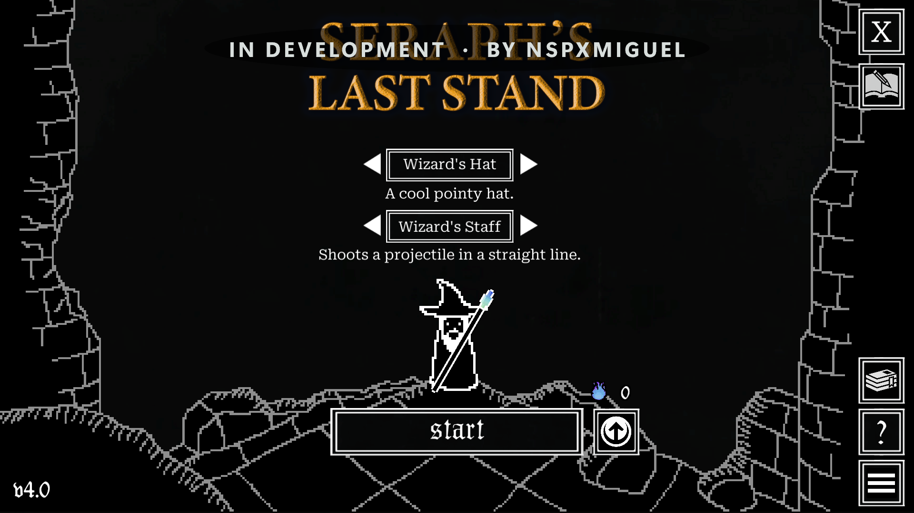

<div align="center">

# Nativra

**Jogos de PC no Xbox. Execução nativa. Sem streaming.**

**Português (Brasil) · [English](README.md)**


**EM DESENVOLVIMENTO · POR NSPXMIGUEL**

</div>

> [!WARNING]
> **AINDA NÃO ESTÁ PRONTO PARA UTILIZAÇÃO. EM FASE DE TESTES E DESENVOLVIMENTO.**
>
> O Nativra é feito por **uma pessoa só**, que também tem outros compromissos.
> É um projeto de hobby, disponibilizado de graça, sem uma equipe por trás.
> Estou investindo meu próprio dinheiro em diversas ferramentas de IA, meu
> tempo e muito esforço para tirar essa ideia do papel — quebrando a cabeça,
> errando, testando e tentando de novo.
>
> Ver um jogo abrir pela primeira vez é uma conquista, **não significa que o
> app esteja pronto**. Não há prazo prometido, garantia de compatibilidade ou
> suporte imediato. Peço paciência e respeito por esse trabalho.
>
> — **NSPXMIGUEL**

[Primeiro marco](docs/progress/2026-09-23.md) ·
[Releases](https://github.com/NspxMiguel/nativra/releases) ·
[Como contribuir](docs/CONTRIBUTING.md) · [Licença](LICENSE)



Captura real do console, build 174. O menu foi exibido; partida estável e recursos
online ainda não foram validados. Não é uma montagem nem uma imagem gerada por IA.

## A ideia

Transformar um Xbox Series X|S no Dev Mode oficial em um aplicativo único para
acessar sua biblioteca e executar jogos de PC no próprio console. Sem streaming,
sem um PC remoto e sem fornecer arquivos de jogos.

O processador executa instruções x86-64 nativamente. O trabalho está no carregador
de executáveis PE e nas pontes para as funções de sistema, gráficos e entrada que
um jogo de Windows espera encontrar. A mesma arquitetura de CPU não torna todos
os jogos automaticamente compatíveis.

## O que já foi demonstrado

- Login na Steam por QR, feito pelo próprio dono da conta.
- Biblioteca de jogos próprios e compartilhados, coleções, busca e filtros.
- Caminho de download dos arquivos pelos servidores da Steam.
- Carregamento dos binários e inicialização de um jogo Unity comercial.
- Menu real de **Seraph's Last Stand**, Steam 1919460, na tela do Xbox Series X.
- Ferramentas de controle remoto e coleta de evidências no console para testes.

O [registro do marco](docs/progress/2026-09-23.md) separa medições, correções e
hipóteses. O pacote mais recente pode conter mudanças ainda não validadas no Xbox.

## O que falta

**Isto é uma prova de conceito pré-alpha, não um produto pronto.**

- Confirmar uma partida jogável e estável, controle e abertura repetida.
- Corrigir e medir a fluidez: o espelhamento tinha um teto de 20 FPS, independente
  do contador de renderização do jogo. Retirar o teto não garante 60 FPS.
- Validar o filtro Baixados e o lançamento pelo botão Jogar em todos os caminhos.
- Fazer o áudio funcionar: o FMOD caiu para saída silenciosa no teste registrado.
- Resolver a integração SteamAPI; online, conquistas, amigos e convites não estão validados.
- Testar LEGO Jurassic World e outros jogos. Não há garantia de compatibilidade.
- Substituir a arte provisória de abertura, rejeitada após avaliação na TV.
- Validar resoluções e desempenho. Jogabilidade em 4K ainda não foi comprovada.

Hoje, carregar outro jogo exige reiniciar o aplicativo. Nenhuma licença ou
autenticação é burlada para fazer um jogo avançar.

## Testes de desenvolvimento

Use o Dev Mode oficial e somente jogos que você possui. A
[release pré-alpha](https://github.com/NspxMiguel/nativra/releases/tag/v0.0.1-prealpha.1)
contém o pacote, as limitações e as instruções de instalação. Faça backup dos
dados antes de desinstalar: a desinstalação remove o armazenamento do aplicativo.

```bash
bun src/xbdev.ts connect
bun src/xbdev.ts install <arquivos-do-pacote>
bun src/xbdev.ts steam games
bun src/xbdev.ts launch kiosk
```

Os builds são feitos no GitHub Actions com Windows. Os caminhos internos e a
identidade do pacote ainda usam `Kiosk` para preservar compatibilidade.

Nunca publique `steam.json`, tokens, QR de login, credenciais, dumps de memória
ou arquivos dos jogos em issues. Revise os logs antes de compartilhar.

## Licença

Gratuito para usar, estudar, modificar e compartilhar, **não para vender**.
Consulte [LICENSE](LICENSE) e [NOTICE.md](NOTICE.md): PolyForm Noncommercial 1.0.0.

Sem jogos, BIOS ou chaves incluídos. Sem bypass de licença. Sem afiliação com
Microsoft, Xbox ou Valve. Desenvolvido por **NSPXMIGUEL**, por hobby.
