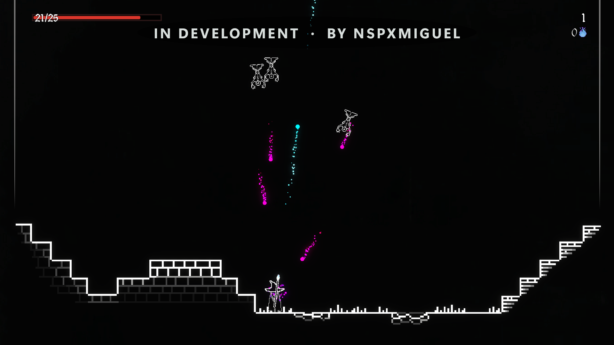

# First verified in-match controls on Xbox

Build 183, source `d62ce08`, September 23, 2026. Seraph's Last Stand
(Steam app 1919460), running locally on Xbox Series X in official Dev Mode.

Unedited 1920×1080 Device Portal capture, not a mockup or PC stream.

## Verified in this test

- Launched the installed game by selecting its library tile inside Nativra.
- Moved the pointer with the right stick and activated Start with A.
- Entered two matches in separate app launches.
- A short input sequence moved the character right and left, jumped with Y,
  aimed upward and fired with A. Screenshots confirmed each action.
- Unity consumed the new raw-input packets. Using XAML's `OriginalKey` fixed
  A being interpreted as Space instead of the controller button.

## Still not ready for normal use

- Startup remains intermittent: build 182 crashed on its first tested launch,
  then reached the menu on four subsequent launches. This is a small sample,
  not a reliability guarantee. Build 183 reached both tested matches.
- Presentation still trails rendering: approximately 39–40 bitmap updates/s
  versus roughly 59 render presents/s in sampled intervals. Neither counter
  measures physical display refresh or proves smooth frame pacing.
- After death, the game displayed “Could not load scoreboard.” Retry did not
  restart the match during this test, and Unity logged null-reference errors.
  Their precise cause is not established.
- SteamAPI initialization and audio remain unresolved. Online play,
  achievements, friends and invitations are not verified.
- These controls were delivered through Device Portal's controller channel.
  A full session with the physical controller still needs validation.

The milestone is actual in-match interaction, not complete compatibility,
stable performance, or a finished release.
